# TRUST

[//]: # ([![DOI]&#40;https://zenodo.org/badge/788965518.svg&#41;]&#40;https://zenodo.org/doi/10.5281/zenodo.11085376&#41;[![CC BY 4.0][cc-by-shield]][cc-by])

<p align="center">
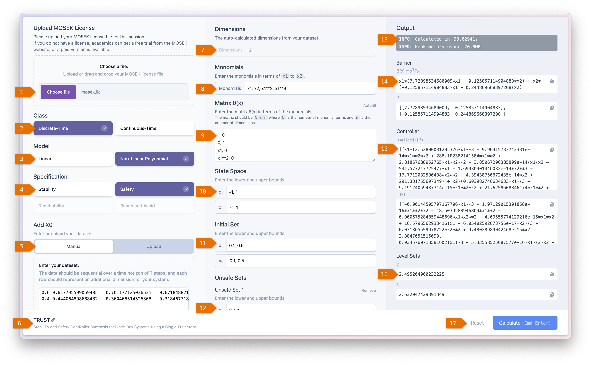
</p>

**TRUST** is an open-source software tool developed for data-driven controller synthesis of dynamical systems with unknown mathematical models, ensuring either stability or safety properties. By collecting only a single input-state trajectory from the unknown system and satisfying a rank condition that ensures the system is persistently excited according to Willems *et al.*'s fundamental lemma, **TRUST** aims to design either control Lyapunov functions (CLF) or control barrier certificates (CBC), along with their corresponding stability or safety controllers. The tool implements sum-of-squares (SOS) optimization programs solely based on data to enforce stability or safety properties across four system classes:
- _continuous-time nonlinear polynomial systems_,
- _continuous-time linear systems_,
- _discrete-time nonlinear polynomial systems_, and
- _discrete-time linear systems_.

**TRUST** is a Python-based web application featuring an intuitive, reactive graphic user interface (GUI) built with web technologies. It can be accessed at <https://trust.tgo.dev> or installed locally, and supports both manual data entry and data file uploads. Leveraging the power of the Python backend and a JavaScript frontend, **TRUST** is designed to be highly user-friendly and accessible across desktop, laptop, tablet, and mobile devices. We apply **TRUST** to a set of physical benchmarks with unknown dynamics, ensuring either stability or safety properties across the four supported classes of models.

## Table of Contents
- [Artifact Evaluation](#Artifact-Evaluation)
- [Installation](#install-instructions)
- [Examples](#examples)
- [Related Paper](#related-paper)
- [Reporting Bugs](#reporting-bugs)
- [License](#license)

## Artifact Evaluation

[//]: # (If you are a reviewer for the HSCC committee, the instructions for how to install and reproduce the results of our paper can be found [here]&#40;./Artifact_Evaluation_Instructions.pdf&#41;. )
We recommend running the tool via Docker, instructions in the installation section following.

# Install Instructions

We have made every effort to ensure the following instructions are comprehensive for the Docker container under consideration.

## Prerequisites

### Docker
Docker is used for this project to simplify the installation process. You can download and install Docker by following their instructions for your operating system at <https://docs.docker.com/get-docker/>.

### Mosek License
Since the underlying packages that TRUST uses rely on the MOSEK solver, we will now install the MOSEK license (a free trial is available and it is free for academic users). Fill in your details to get a Mosek license at <https://www.mosek.com/license/request/?i=acp>.

The license file will be emailed to you with instructions of where to place the file in your home directory. This license is required within the TRUST GUI, where you will be prompted to upload the file.

## Installing TRUST

You can download the repository from Github at <https://github.com/thatgardnerone/TRUST>. Simply navigate to the page and click the green "Code" button, then "Download ZIP". Once downloaded, unzip the folder to your home directory which on Windows is usually `C:\Users\YourUsername` and on macOS and Linux is `/home/YourUsername`.

Change the folder name to `TRUST` to simplify the later steps.

The following steps will be run in a terminal. You can open a terminal on macOS by pressing `Cmd + Space` and typing "Terminal", or on Windows by pressing `Win + R` and typing `cmd`, then pressing `Enter`. On Linux, search for it in the applications menu as it varies by distribution.


### Change directory to TRUST
Once you have a terminal open, navigate to the `TRUST` folder by running the following

```bash
# On macOS and Linux
cd ~/TRUST
```
Or on Windows
```cmd
cd $HOME\TRUST
```

### Copy the environment file
The project contains an example environment file containing the relevant environment configuration variables, `.env.example`, which you can copy to a new file called `.env` by running:
    
```bash
# On macOS and Linux
cp .env.example .env
```
Or on Windows
```cmd
copy .env.example .env
```

### Build and run the Docker container
Next, build and run the Docker container by running:

```bash
# On any OS
docker compose up --build -d
```

### View the tool
Finally, you can now access the tool by navigating to `http://127.0.0.1:5000` in your web browser.

# Examples

We present some selected examples graphically to demonstrate some use cases of TRUST. 
All the examples can be found in the folder `TRUST/storage/cases` where the case studies are organised in subfolders each containing the necessary data files and inputs for the example.

For each of the safety examples, the following conventions are used.
- The initial region is shown in blue.
- The unsafe region(s) are shown in red.
- The gamma level set is shown in dashed red lines.
- The lambda level set is shown in dashed blue lines.
- Trajectories are shown in black, starting from the initial region and staying within the safe level set.

### Examples 1 and 2 - Continuous Time Nonlinear Polynomial Systems (Safety)
<p align="center">
    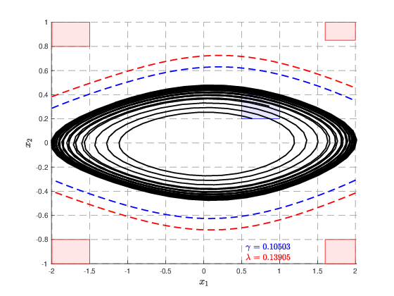
    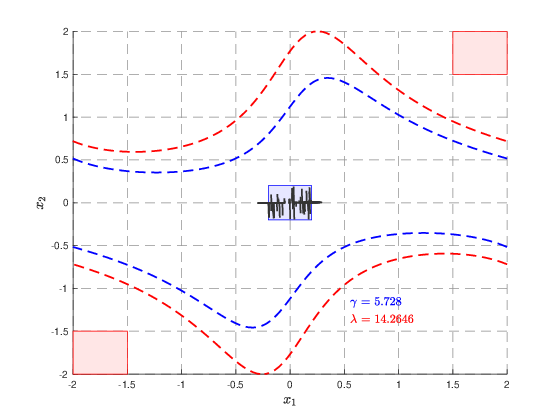
</p>

The first figure shows a safe ct-NPS predator-prey system.

The second figure shows a safe ct-NPS Van der Pol oscillator system.

### Example 3 to 5 - Continuous Time Linear Systems (Safety)
<p align="center">
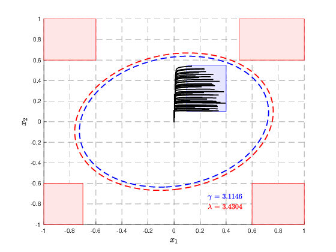
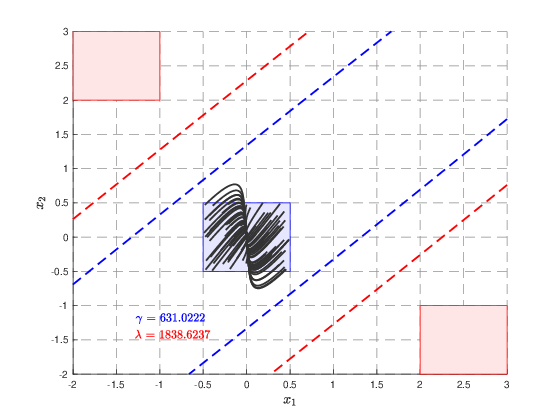
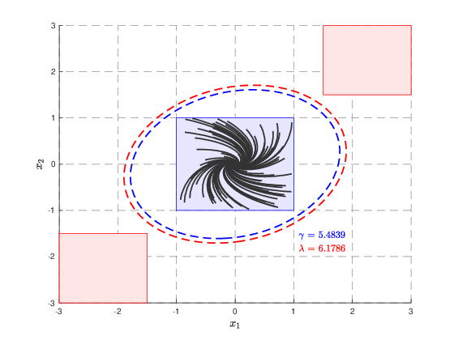
</p>

The first figure shows a safe ct-LS DC motor system.

The second figure shows a safe ct-LS room temperature system.

The third figure shows a safe ct-LS two-tank system.

### Examples 6 and 7 - Discrete Time Nonlinear Polynomial Systems (Safety)
<p align="center">
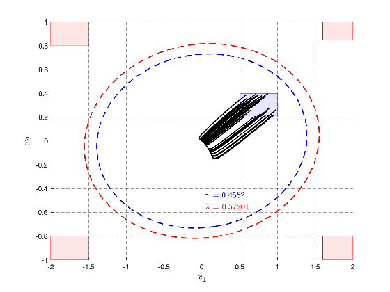
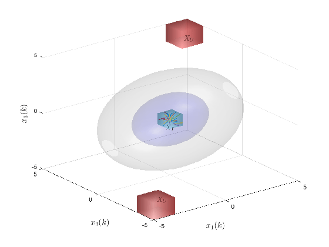
</p>

The first figure shows a safe dt-NPS predator-prey system.

The second figure shows a safe dt-NPS Lorenz system.

### Examples 8 to 11 - Discrete Time Linear Systems (Safety)

<p align="center">
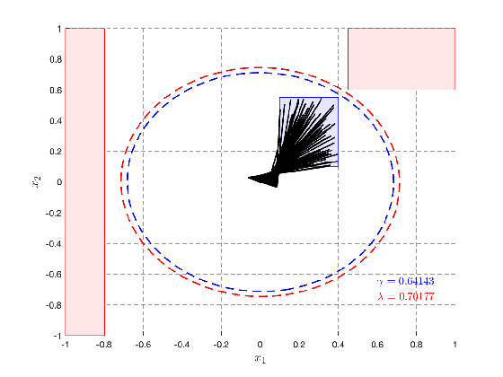
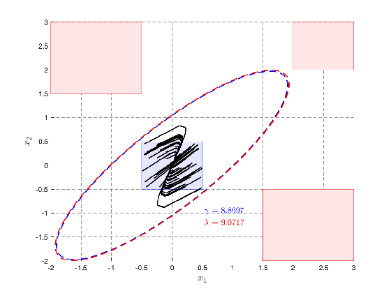
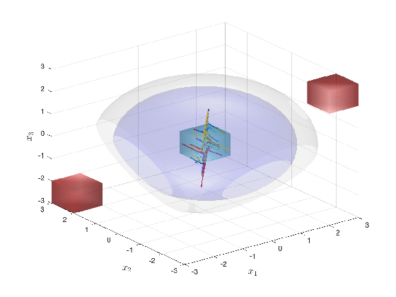
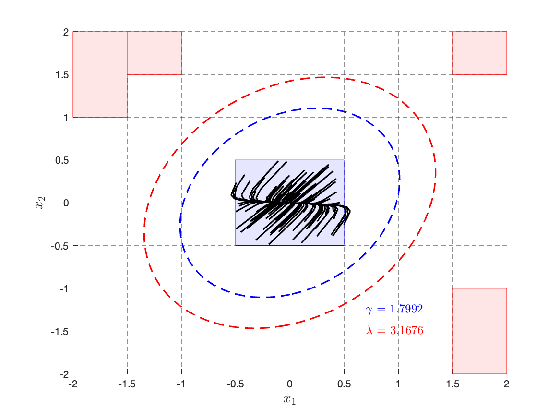
</p>

The first figure shows a safe dt-LS DC motor system.

The second figure shows a safe dt-LS room temperature system.

The third figure shows a safe 3D dt-LS room temperature system.

The fourth figure shows a safe dt-LS two-tank system.

### Examples 12 and 13 - Continuous Time Nonlinear Polynomial Systems (Stability)

<p align="center">
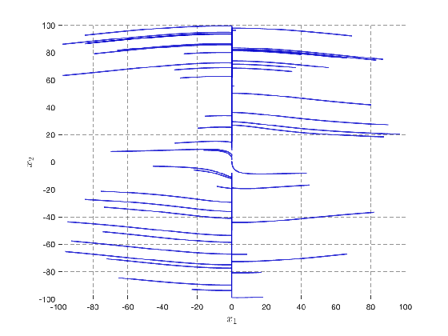
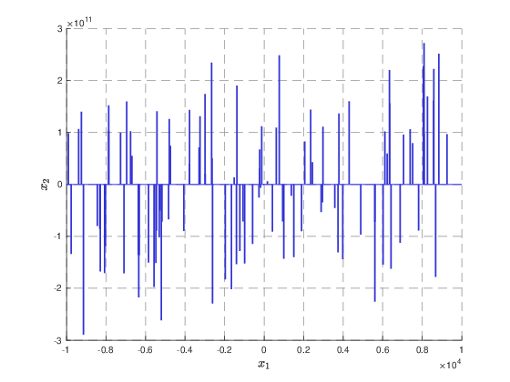

The first figure shows a stable ct-NPS predator-prey system.

The second figure shows a stable ct-NPS Van der Pol oscillator system.

### Examples 14 to 16 - Continuous Time Linear Systems (Stability)

<p align="center">
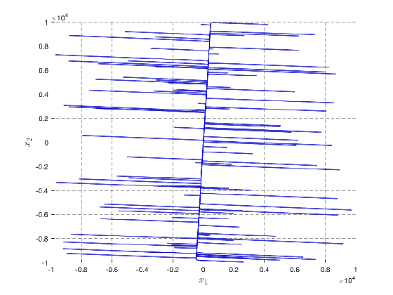
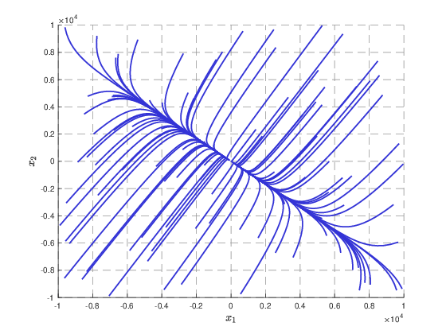
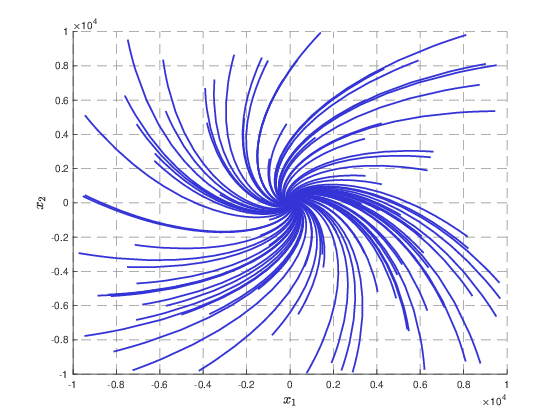

The first figure shows a stable ct-LS DC motor system.

The second figure shows a stable ct-LS room temperature system.

The third figure shows a stable ct-LS two-tank system.

### Examples 17 and 18 - Discrete Time Nonlinear Polynomial Systems (Stability)

<p align="center">
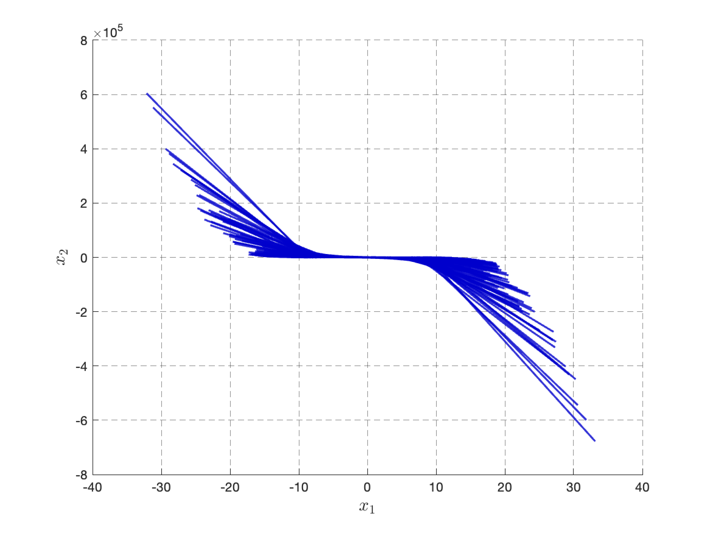
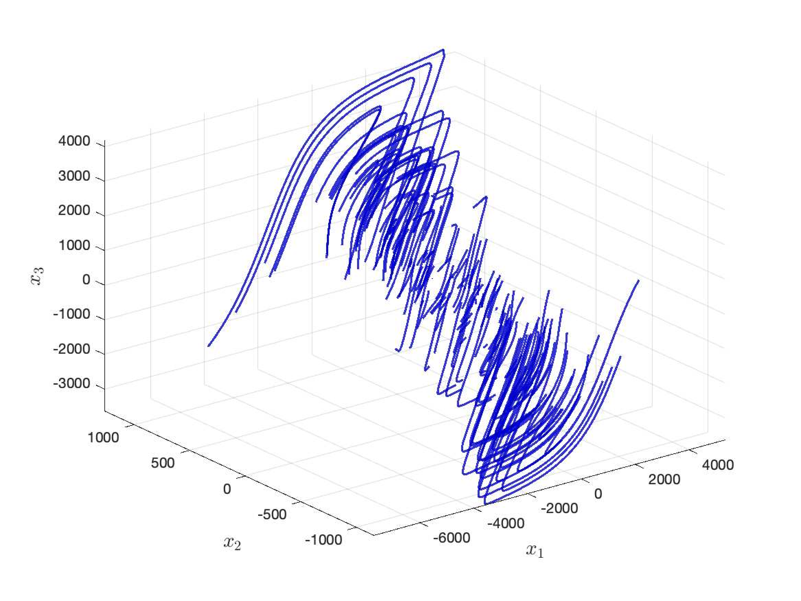

The first figure shows a stable dt-NPS academic system.

The second figure shows a stable dt-NPS Lorenz system.

### Examples 19 to 22 - Discrete Time Linear Systems (Stability)

<p align="center">
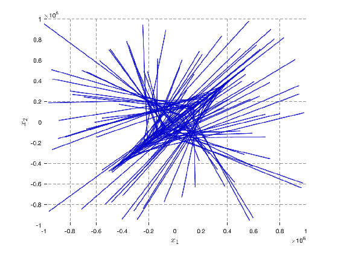
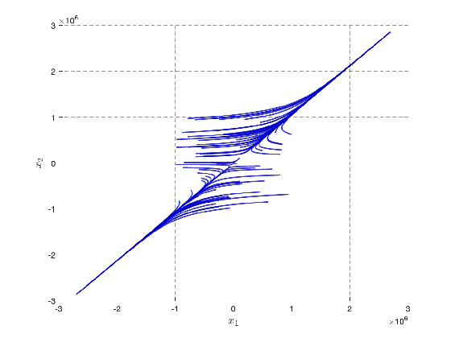
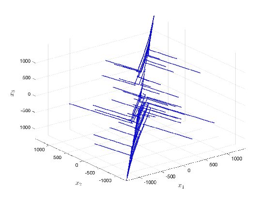
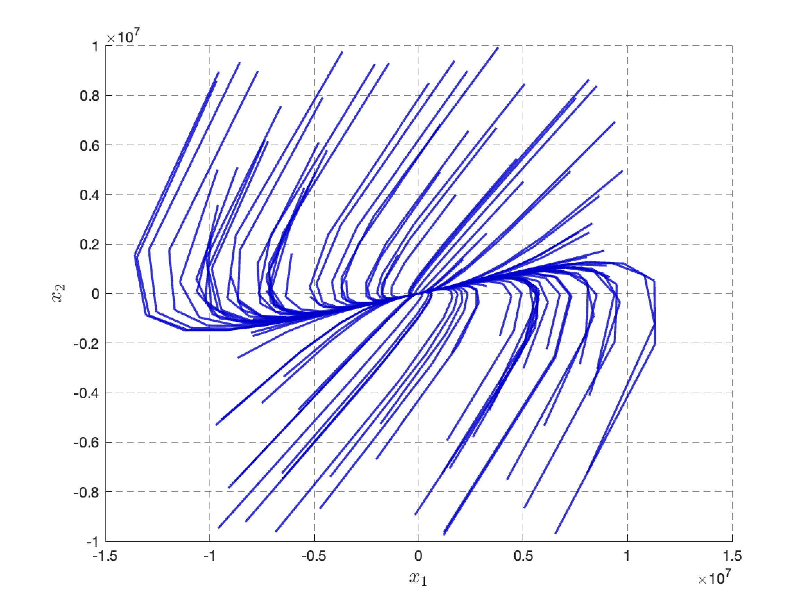

The first figure shows a stable dt-LS DC motor system.

The second figure shows a stable dt-LS room temperature system.

The third figure shows a stable 3D dt-LS room tem§perature system.

The fourth figure shows a stable dt-LS two-tank system.

## Related Paper

The arXiv version of the paper is located [here]().

### Authors
- [Jamie Gardner](https://github.com/thatgardnerone)
- [Ben Wooding](https://woodingben.com)
- [Amy Nejati](https://www.amy-nejati.de/)
- [Abolfazl Lavaei](https://lavaei-cps.de/)

### Citing TRUST

```
@misc{tbc,
      title={TRUST: Controller Synthesis for Unknown Models Using a Single Trajectory}, 
      author={Jamie Gardner and Ben Wooding and Amy Nejati and Abolfazl Lavaei},
      year={2024},
      eprint={tbc},
      archivePrefix={arXiv},
      primaryClass={eess.SY}
}
```

## Reporting Bugs
If you encounter any issues or have feedback, please open an issue in the repository. We appreciate your input and will address it as soon as possible.

## License
This work is licensed under a
[Creative Commons Attribution 4.0 International License][cc-by].

[![CC BY 4.0][cc-by-image]][cc-by]

[cc-by]: http://creativecommons.org/licenses/by/4.0/
[cc-by-image]: https://i.creativecommons.org/l/by/4.0/88x31.png
[cc-by-shield]: https://img.shields.io/badge/License-CC%20BY%204.0-lightgrey.svg